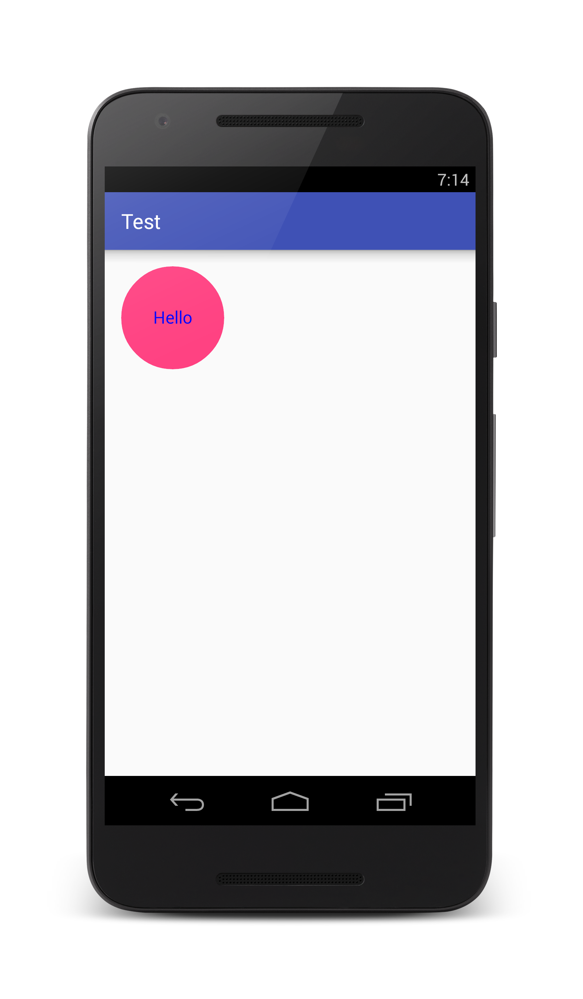

# CircularImage
[Android Library] Library that creates a circled - shape imageView , from an external source or a chosen color.

 
| 


##Instructions 

 * Since this library is included in JCenter you need to put this line in you app's module ```build.gradle```
 
      ```compile 'com.example.marius.circularimage:circularimage:1.0.0'```
   
      The file should look like this :

```
....
dependencies {
  # other dependencies
   compile 'com.example.marius.circularimage:circularimage:1.0.0'
}
```

 *  Don't forget to include

```java 
<uses-permission android:name="android.permission.INTERNET"/> 
``` 
in your ```AndroidManifest.xml ``` 
    
    
## Sample Use

```java
ImageView mImgView = (ImageView) findViewById(R.id.img);

CircularImage mImage = new CircularImage(this); //Context

mImage.
      .setSize(200,200)
      .setText("Hello")
      .setTextSize(30)
      .setTextColor(Color.BLUE)
      .setColorImage(R.color.colorAccent)
      .buildInto(mImgView);
      
      //This should create an image like in the first example.
```

For the second example we used an external source , so just replace ```.setColorImage() ``` with ```.setContentImage(URL url);``` or ```.setContentImage(String url);``` 

Notice that ```.buildInto(ImageView imageView);``` should be the last function called so that the object can get its attributes and start processing the image.

More on [Wiki](https://github.com/mariusdotspinu/CircularImage/wiki).
